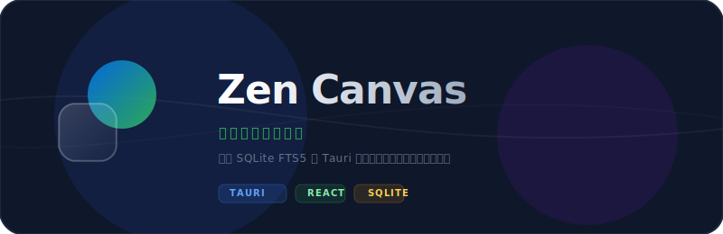

# Zen Canvas

<div align="center">
  
</div>

<br />

<div align="center">
  <a href="README_en.md">
    
  </a>
</div>

<div align="center">
  
  
  
  
  
  
</div>

---

## 简介

> **本地优先的个人文件生命周期管理助手。**
> Zen Canvas 不替代系统资源管理器，也不是简单文件分类器；它把空间扫描、快速索引、智能解释、整理预览、安全执行和恢复记录串成一个可控闭环。

## 核心体验

- **空间扫描**：支持扫描用户空间或选择指定文件夹；项目目录会被识别为父级项目资产，默认不深入移动内部工程文件。
- **顶部搜索**：常驻顶部中央，Windows 使用 `Ctrl + K`，macOS 使用 `⌘ K`；主窗口关闭时可唤起独立毛玻璃搜索框。
- **智能整理**：用“正在使用 / 可归档 / 隐私敏感 / 临时清理”四区解释文件去向，不直接执行真实操作。
- **文件库**：用于查看扫描结果、状态筛选和分类原因；具体找文件优先使用顶部搜索。
- **预览执行**：按主文件夹和子文件夹展示整理方案，所有移动、重命名、移动加重命名都必须先确认。
- **自动规则**：内置规则不可删除，用户规则可长期生效；高级构建器默认折叠。
- **恢复记录**：只恢复 Zen Canvas 自己执行过的操作，默认按批次保留 30 天，可在设置中改为 15 / 60 / 90 天。

## 搜索能力

- 本地 SQLite + FTS5 索引，不依赖 Everything、Spotlight 或系统搜索服务。
- 支持文件名、路径、空格分词和扩展名过滤。
- 排序结合相关性、最近修改、最近打开和路径深度。
- 结果支持打开文件、系统定位、进入文件库详情。
- 当前包含架构守卫测试；真实 10 万条索引 benchmark 将作为后续性能基准补充。

## 安全边界

- 启动不自动扫描，扫描只建立索引和建议。
- MVP 不执行删除；删除只作为建议。
- 敏感文件只显示建议和原因，不生成默认可执行勾选。
- 冲突、低置信、规则接近项默认进入待确认队列。
- 执行层会再次校验操作类型、绝对路径、安全文件名、源路径一致性、系统目录和覆盖冲突。
- 桌面层使用 Tauri 2 + Rust IPC，前端不直接访问文件系统；扫描、索引、移动、重命名和恢复都在 Rust 命令层校验。

## 技术架构

```text
React 19 UI
  -> Tauri 2 IPC commands / events
    -> Rust backend
      -> rusqlite + SQLite WAL + FTS5 trigram
      -> r2d2 connection pool
      -> notify watcher + jwalk scanner
      -> guarded move / rename / restore executor
```

## 开发

```bash
npm install
npm run dev
npm run typecheck
npm test
cd src-tauri && cargo test -p zen-canvas-tauri && cd ..
npm run test:performance
npm run build
npm run security:audit
```

完整发布前验证：

```bash
npm run verify
```

## 打包与发布

本项目已迁移到 Tauri 2，当前打包入口为 Tauri 构建。默认构建会生成当前平台的桌面应用和安装包；签名配置后续预留。

```bash
npm run assets:brand
npm run build
```

Windows 构建会输出 NSIS 安装包到 `src-tauri/target/release/bundle/nsis/`。跨平台发布矩阵和签名流程会随 Tauri 发布配置继续完善。
