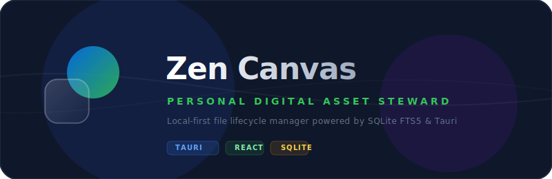

# Zen Canvas

<div align="center">
  
</div>

<br />

<div align="center">
  <a href="README.md">
    
  </a>
</div>

<div align="center">
  
  
  
  
  
  
</div>

---

## Introduction

> **A local-first personal file lifecycle assistant.**
> Zen Canvas is not a file explorer replacement or a simple classifier. It connects scanning, fast indexing, explainable organization, safe preview execution, and restore records into one controlled local workflow.

## Core Experience

- **Space Scan**: scan user space or selected folders. Project directories are summarized as parent project assets, so configured engineering environments are not casually moved.
- **Top Search**: stays centered in the title bar. Use `Ctrl + K` on Windows and `⌘ K` on macOS; when the main window is closed, the shortcut opens a standalone frosted search box.
- **Smart Organize**: explains suggested destinations through four clear zones: In Use, Archive Ready, Private, and Cleanup.
- **File Library**: browse scan results, status filters, and classification reasons. Use top search for finding a specific file.
- **Preview Execute**: groups plans by main folders and subfolders. Every move, rename, or combined action must be confirmed first.
- **Auto Rules**: built-in rules are stable; user rules can apply globally. The advanced builder stays folded by default.
- **Restore Records**: only restores operations executed by Zen Canvas, grouped by batch and kept for 30 days by default, configurable to 15 / 60 / 90 days.

## Search

- Local SQLite + FTS5 indexing, with no dependency on Everything, Spotlight, or OS search backends.
- Supports filename search, path search, tokenized terms, and extension filters.
- Ranking combines relevance, recent modification, recent opens, and path depth.
- Results can open files, reveal them in the system file manager, or open File Library details.
- The current suite includes architecture guard tests; a real 100k-index benchmark will be added as a future performance baseline.

## Safety

- The app does not scan automatically on launch. Scanning only creates an index and suggestions.
- Deletion is suggestion-only in the MVP.
- Sensitive files show advice and reasons, but are not selected for execution.
- Conflicts, low-confidence items, and close rule scores enter manual confirmation by default.
- The execution layer revalidates operation type, absolute paths, safe filenames, source-path consistency, protected system targets, and overwrite conflicts.
- The desktop layer uses Tauri 2 + Rust IPC. The frontend does not access the file system directly; scanning, indexing, moving, renaming, and restore operations are validated in Rust commands.

## Architecture

```text
React 19 UI
  -> Tauri 2 IPC commands / events
    -> Rust backend
      -> rusqlite + SQLite WAL + FTS5 trigram
      -> r2d2 connection pool
      -> notify watcher + jwalk scanner
      -> guarded move / rename / restore executor
```

## Development

```bash
npm install
npm run dev
npm run typecheck
npm test
cd src-tauri && cargo test -p zen-canvas-tauri && cd ..
npm run test:performance
npm run build
npm run security:audit
```

Full release verification:

```bash
npm run verify
```

## Packaging

Zen Canvas has moved to Tauri 2. The current packaging entrypoint is the Tauri build, which produces the desktop app and installer for the current platform. Signing hooks are reserved for later.

```bash
npm run assets:brand
npm run build
```

Windows builds output the NSIS installer under `src-tauri/target/release/bundle/nsis/`. The cross-platform release matrix and signing flow will be refined alongside the Tauri release configuration.
